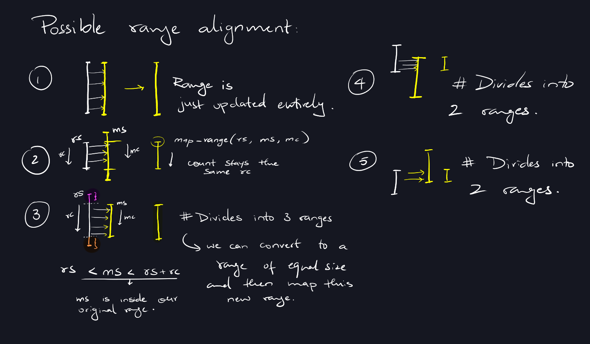

# Day 5 Part 2

Personally, I find that Part 1 of the problem is quite straightforward. It
essentially involves continuously translating a map and then determining the
minimum value. However, the real challenge emerges in Part 2. It seems like the
creator of these problems decided to particularly test the mettle of C
programmers with this one.

Unlike Part 1, where we dealt with a limited set of starting values or 'seeds',
Part 2 introduces us to an entirely different ball game. We're now faced with
vast ranges of seeds, and the task is to track all of them effectively.

My initial approach was somewhat naive. I thought I could simply convert these
broad ranges into individual seeds and apply the same strategy I used for Part
1. With a bit of overconfidence, I coded this solution and set it running. But
soon, I sensed trouble. My computer began to struggle, and it didn't take long
for my concerns to be validated. In less than five seconds, my machine had
exhausted its 16 GB of RAM, and to make matters worse, it started eating into
the swap memory. Fortunately, the slower allocation speed of swap memory acted
as a saving grace, preventing my computer from a complete crash.

After this realization, I began planning my approach to handling ranges. Each
time a range is translated by a map range, it falls in one of the following
cases:

Coding this concept into my program - after a bunch of memory issues because of
the ranges and reallocation issues - I was able to solve the problem.
